# AutoRev Database Design & Optimization Review

**Date:** January 11, 2026  
**Reviewer:** AI Assistant  
**Scope:** Comprehensive analysis of schema design, redundancy, AL optimization, and migration planning

---

## Executive Summary

### Key Issues & Priority

| Priority | Issue | Impact | Effort | Recommendation |
|----------|-------|--------|--------|----------------|
| 🔴 P0 | Dual identifier pattern (car_slug/car_id) | Query complexity, confusion | Medium | Standardize on car_id, keep slug for URLs |
| 🔴 P0 | Known issues duplicated in 3 tables | Data inconsistency | Low | Consolidate to `car_issues` as SoT |
| 🟠 P1 | Upgrade data in 3+ locations | Maintenance burden | Medium | Consolidate to `car_tuning_profiles` |
| 🟠 P1 | AL RPC uses OR clauses for slug/id | Query performance | Low | Use car_id after initial resolution |
| 🟡 P2 | JSONB over-use in `cars` table | Query flexibility | High | Selective normalization |
| 🟡 P2 | Missing FK relationships | Data integrity | Medium | Add FKs where beneficial |

### Health Score Improvement Path

| Metric | Current | After P0 | After P1 | Target |
|--------|---------|----------|----------|--------|
| Schema Design | 78/100 | 82/100 | 88/100 | 90/100 |
| Data Integrity | 95/100 | 98/100 | 99/100 | 100/100 |
| AL Efficiency | 85/100 | 90/100 | 95/100 | 95/100 |

---

## Part 1: Data Model Assessment

### 1.1 Entity-Relationship Diagram (Current State)

```mermaid
erDiagram
    CARS {
        uuid id PK
        text slug UK
        text name
        int hp
        int torque
        text category
        jsonb upgrade_recommendations
        jsonb popular_track_mods
    }
    
    CAR_VARIANTS {
        uuid id PK
        uuid car_id FK
        text variant_key
        text display_name
    }
    
    CAR_TUNING_PROFILES {
        uuid id PK
        uuid car_id FK
        text car_slug
        jsonb upgrades_by_objective
        jsonb performance_potential
    }
    
    CAR_ISSUES {
        uuid id PK
        uuid car_id FK
        text car_slug
        text title
        text severity
    }
    
    VEHICLE_KNOWN_ISSUES {
        uuid id PK
        text car_slug
        text issue_title
        text severity
    }
    
    COMMUNITY_INSIGHTS {
        uuid id PK
        uuid car_id FK
        text car_slug
        text insight_type
        text title
        vector embedding
    }
    
    PARTS {
        uuid id PK
        text name
        text category
    }
    
    PART_FITMENTS {
        uuid id PK
        uuid part_id FK
        uuid car_id FK
        text car_slug
    }
    
    USER_VEHICLES {
        uuid id PK
        uuid user_id FK
        uuid matched_car_id FK
        text matched_car_slug
        jsonb installed_modifications
    }
    
    USER_PROJECTS {
        uuid id PK
        uuid user_id FK
        uuid car_id FK
        text car_slug
        jsonb selected_upgrades
    }
    
    UPGRADE_PACKAGES {
        uuid id PK
        text car_slug
        text name
        text tier
    }
    
    UPGRADE_KEY_PARTS {
        uuid id PK
        uuid part_id FK
        text upgrade_key
    }
    
    YOUTUBE_VIDEOS {
        text video_id PK
        text title
        jsonb pros_mentioned
        jsonb cons_mentioned
    }
    
    YOUTUBE_VIDEO_CAR_LINKS {
        uuid id PK
        text video_id FK
        uuid car_id FK
        text car_slug
    }

    CARS ||--o{ CAR_VARIANTS : "has"
    CARS ||--o| CAR_TUNING_PROFILES : "has"
    CARS ||--o{ CAR_ISSUES : "has"
    CARS ||--o{ COMMUNITY_INSIGHTS : "has"
    CARS ||--o{ PART_FITMENTS : "fits"
    CARS ||--o{ USER_VEHICLES : "matches"
    CARS ||--o{ USER_PROJECTS : "for"
    CARS ||--o{ YOUTUBE_VIDEO_CAR_LINKS : "featured_in"
    PARTS ||--o{ PART_FITMENTS : "fits"
    PARTS ||--o{ UPGRADE_KEY_PARTS : "implements"
    YOUTUBE_VIDEOS ||--o{ YOUTUBE_VIDEO_CAR_LINKS : "linked"
```



### 1.2 Redundant Data Storage Analysis

| Data Type | Location 1 | Location 2 | Location 3 | Rows | Source of Truth |
|-----------|------------|------------|------------|------|-----------------|
| **Upgrade Recommendations** | `cars.upgrade_recommendations` (JSONB) | `car_tuning_profiles.upgrades_by_objective` | `data/carUpgradeRecommendations.js` (static) | 309 | ⚠️ **Fragmented** |
| **Known Issues** | `car_issues` | `vehicle_known_issues` | `community_insights` (type='known_issue') | 6,202 + 89 + ~120 | `car_issues` |
| **Market Pricing** | `cars.price_avg` | `car_market_pricing` | `car_price_history` | 309 + 10 + 7 | `car_market_pricing` (sparse) |
| **YouTube Reviews** | `youtube_videos` | `youtube_video_car_links` | `featured_content` | 1,030 + 1,077 + 166 | ✅ **Correct** (different purposes) |
| **Service Intervals** | `vehicle_service_intervals` | `vehicle_maintenance_specs` | — | 3,093 + 305 | ✅ **Correct** (intervals vs specs) |

### 1.3 Source of Truth Mapping

| Domain | Primary Table | Backup/Cache | Read Pattern | Write Pattern |
|--------|---------------|--------------|--------------|---------------|
| **Car Specs** | `cars` | — | Direct query | Admin-only |
| **Tuning Data** | `car_tuning_profiles` | `cars.upgrade_recommendations` (deprecated) | RPC + direct | Admin scripts |
| **Known Issues** | `car_issues` | — | Direct query, AL tool | NHTSA import + manual |
| **Community Knowledge** | `community_insights` | — | Vector search | Forum scraper |
| **Parts Catalog** | `parts` + `part_fitments` | — | Search API | Vendor ingestion |
| **User Garage** | `user_vehicles` | — | Auth-scoped | User writes |
| **Build Projects** | `user_projects` | — | Auth-scoped | User writes |
| **YouTube Reviews** | `youtube_videos` + `youtube_video_car_links` | — | Car-filtered | Cron ingestion |

### 1.4 Implicit Relationships (Missing FKs)

| Table | Column | Should Reference | Has FK? | Priority |
|-------|--------|------------------|---------|----------|
| `user_vehicles` | `installed_modifications` (JSONB array) | `upgrade_keys.key` | ❌ No (JSONB) | P2 |
| `upgrade_packages` | — | `parts` via `upgrade_key_parts` | ❌ Empty table | P2 |
| `car_issues` | — | `car_recalls` (related recalls) | ❌ No | P3 |
| `car_slug_aliases` | `canonical_slug` | `cars.slug` | ❌ No | P2 |
| `community_insights` | `car_slug` | `cars.slug` | ❌ No (has car_id FK) | P3 |

---

## Part 2: Normalization Analysis

### 2.1 JSONB Column Evaluation

#### cars Table (27 JSONB columns)

| Column | Query Pattern | Searchable? | Update Freq | Recommendation |
|--------|---------------|-------------|-------------|----------------|
| `upgrade_recommendations` | AL context, Tuning Shop | No | Rare | 🔴 **Deprecate** → use `car_tuning_profiles` |
| `popular_track_mods` | Car detail page | No | Rare | 🔴 **Deprecate** → use `car_tuning_profiles` |
| `external_consensus` | AL context | No | Weekly | ✅ Keep (AI-generated) |
| `expert_consensus_summary` | Car detail | No | Weekly | ✅ Keep (AI-generated) |
| `pros` / `cons` | Car detail | No | Rare | ✅ Keep (editorial) |
| `common_issues` | Car detail | No | Rare | 🟡 Consider → `car_issues` link |
| `notable_variants` | Car detail | No | Rare | ✅ Keep (editorial) |

#### car_tuning_profiles Table (9 JSONB columns)

| Column | Query Pattern | Searchable? | Update Freq | Recommendation |
|--------|---------------|-------------|-------------|----------------|
| `upgrades_by_objective` | Tuning Shop, AL | Yes (keys) | Occasional | ✅ Keep (structured but flexible) |
| `performance_potential` | Tuning Shop | No | Rare | ✅ Keep |
| `stage_progressions` | Legacy | No | Never | 🔴 **Deprecate** |
| `component_limits` | Tuning Shop | No | Rare | ✅ Keep |
| `curated_packages` | Tuning Shop | No | Rare | ✅ Keep |

#### user_vehicles Table

| Column | Query Pattern | Searchable? | Recommendation |
|--------|---------------|-------------|----------------|
| `installed_modifications` | Garage display, AL health | By key | 🟡 **Consider normalizing** to `user_vehicle_modifications` table |

### 2.2 Normalization Cost/Benefit Analysis

#### Option A: Normalize `installed_modifications`

**New Table:**
```sql
CREATE TABLE user_vehicle_modifications (
  id UUID PRIMARY KEY DEFAULT gen_random_uuid(),
  user_vehicle_id UUID REFERENCES user_vehicles(id) ON DELETE CASCADE,
  upgrade_key TEXT NOT NULL,
  part_id UUID REFERENCES parts(id), -- optional: actual part used
  installed_at TIMESTAMPTZ DEFAULT now(),
  notes TEXT,
  UNIQUE(user_vehicle_id, upgrade_key)
);
```

| Benefit | Cost |
|---------|------|
| Can query "which users have X mod" | Migration effort |
| Can link to actual parts | More JOINs for garage display |
| Can track install dates | API contract change |
| Better data integrity | — |

**Recommendation:** 🟡 P2 - Nice to have, not critical

#### Option B: Normalize `upgrade_recommendations` in cars

**Already exists:** `car_tuning_profiles.upgrades_by_objective`

**Migration path:**
1. Ensure `car_tuning_profiles` has data for all 309 cars ✅ (verified)
2. Update AL's `getCarAIContext` to use `car_tuning_profiles` first
3. Update Tuning Shop to read from `car_tuning_profiles`
4. Deprecate `cars.upgrade_recommendations`

**Recommendation:** 🔴 P1 - Execute as part of tuning consolidation

---

## Part 3: AL Optimization

### 3.1 Current AL Data Flow

```
User Query → /api/ai-mechanic
              ↓
         Build System Prompt (includes user context)
              ↓
         Send to Claude with Tools
              ↓
         Claude calls tools:
              ├── get_car_ai_context(slug) ← Single RPC, 8+ table aggregation
              ├── search_cars(query, filters) ← FTS or client fallback
              ├── search_knowledge(query, car_slug) ← Vector search
              ├── search_community_insights(query, car_slug) ← Vector search
              ├── get_known_issues(car_slug) ← Direct query
              ├── search_parts(query, car_slug) ← FTS + fitment join
              ├── get_maintenance_schedule(car_slug) ← RPC
              ├── get_dyno_runs(car_slug) ← RPC
              ├── get_track_lap_times(car_slug) ← RPC
              └── analyze_vehicle_health(vehicle_id) ← RPC
```

### 3.2 Identified N+1 Problems

| Tool | Issue | Impact | Fix |
|------|-------|--------|-----|
| `getCarDetails` | Falls back to `getCarAIContext` + additional queries | 2-3 queries instead of 1 | Use `get_car_ai_context` exclusively |
| `getKnownIssues` | Queries `car_issues` then `vehicle_known_issues` as fallback | 2 queries | Remove `vehicle_known_issues` fallback |
| `searchKnowledge` | Resolves car_slug → car_id before search | Extra query | Pass car_id directly when available |

### 3.3 get_car_ai_context RPC Analysis

**Current Implementation (from 022_ai_db_foundations.sql):**

```sql
-- Current: Uses OR clauses for both identifiers
SELECT ... FROM car_fuel_economy f 
WHERE f.car_id = v_car_id OR f.car_slug = p_car_slug

-- Problem: OR prevents index-only scans
-- Fix: Use car_id exclusively after initial resolution
SELECT ... FROM car_fuel_economy f 
WHERE f.car_id = v_car_id
```

**Recommendation:** Optimize RPC to use `car_id` exclusively:

```sql
CREATE OR REPLACE FUNCTION get_car_ai_context_v2(p_car_slug TEXT)
RETURNS JSONB AS $$
DECLARE
  v_car_id UUID;
  v_result JSONB;
BEGIN
  -- Single slug resolution
  SELECT id INTO v_car_id FROM cars WHERE slug = p_car_slug;
  IF v_car_id IS NULL THEN
    RETURN jsonb_build_object('error', 'car_not_found', 'car_slug', p_car_slug);
  END IF;

  SELECT jsonb_build_object(
    'car', to_jsonb(c),
    -- Use car_id ONLY (no OR car_slug)
    'fuelEconomy', (SELECT to_jsonb(f) FROM car_fuel_economy f WHERE f.car_id = v_car_id LIMIT 1),
    'safety', (SELECT to_jsonb(s) FROM car_safety_data s WHERE s.car_id = v_car_id LIMIT 1),
    'marketPricing', (SELECT to_jsonb(p) FROM car_market_pricing p WHERE p.car_id = v_car_id LIMIT 1),
    -- ... rest of fields using car_id only
  )
  INTO v_result
  FROM cars c
  WHERE c.id = v_car_id;

  RETURN COALESCE(v_result, '{}'::jsonb);
END;
$$ LANGUAGE plpgsql STABLE SECURITY DEFINER;
```

### 3.4 Proposed New AL RPCs

#### get_car_tuning_context(car_slug)

Optimized RPC for Tuning Shop and AL `recommend_build` tool:

```sql
CREATE OR REPLACE FUNCTION get_car_tuning_context(p_car_slug TEXT)
RETURNS JSONB AS $$
DECLARE
  v_car_id UUID;
BEGIN
  SELECT id INTO v_car_id FROM cars WHERE slug = p_car_slug;
  IF v_car_id IS NULL THEN
    RETURN jsonb_build_object('error', 'car_not_found');
  END IF;

  RETURN jsonb_build_object(
    'car', (
      SELECT jsonb_build_object(
        'id', c.id,
        'slug', c.slug,
        'name', c.name,
        'hp', c.hp,
        'torque', c.torque,
        'engine', c.engine
      )
      FROM cars c WHERE c.id = v_car_id
    ),
    'tuningProfile', (
      SELECT jsonb_build_object(
        'upgrades_by_objective', tp.upgrades_by_objective,
        'performance_potential', tp.performance_potential,
        'platform_strengths', tp.platform_strengths,
        'platform_weaknesses', tp.platform_weaknesses,
        'component_limits', tp.component_limits
      )
      FROM car_tuning_profiles tp WHERE tp.car_id = v_car_id
    ),
    'availableParts', (
      SELECT COALESCE(jsonb_agg(jsonb_build_object(
        'part_id', p.id,
        'name', p.name,
        'category', p.category,
        'brand', p.brand_name,
        'fitment', jsonb_build_object(
          'verified', pf.verified,
          'requires_tune', pf.requires_tune,
          'install_difficulty', pf.install_difficulty
        )
      )), '[]'::jsonb)
      FROM part_fitments pf
      JOIN parts p ON p.id = pf.part_id
      WHERE pf.car_id = v_car_id
      AND p.is_active = true
    ),
    'dynoBaseline', (
      SELECT jsonb_build_object(
        'peak_whp', dr.peak_whp,
        'peak_wtq', dr.peak_wtq,
        'source_url', dr.source_url
      )
      FROM car_dyno_runs dr
      WHERE dr.car_id = v_car_id
      AND dr.run_kind = 'baseline'
      ORDER BY dr.verified DESC, dr.created_at DESC
      LIMIT 1
    )
  );
END;
$$ LANGUAGE plpgsql STABLE SECURITY DEFINER;
```

### 3.5 AL Tool Primary Source Mapping

| AL Tool | Primary Table(s) | RPC Function | Cache TTL |
|---------|------------------|--------------|-----------|
| `get_car_ai_context` | 8+ tables | `get_car_ai_context` | 2 min |
| `search_cars` | `cars` | `search_cars_fts` | None |
| `get_known_issues` | `car_issues` | Direct query | None |
| `search_parts` | `parts`, `part_fitments` | Direct query | None |
| `search_knowledge` | `document_chunks` | `search_document_chunks` | 5 min |
| `search_community_insights` | `community_insights` | `search_community_insights` | 5 min |
| `get_maintenance_schedule` | `vehicle_maintenance_specs`, `vehicle_service_intervals` | `get_car_maintenance_summary` | None |
| `get_dyno_runs` | `car_dyno_runs` | `get_car_dyno_runs` | 10 min |
| `get_track_lap_times` | `car_track_lap_times` | `get_car_track_lap_times` | 10 min |
| `analyze_vehicle_health` | `user_vehicles`, `car_issues` | `analyze_vehicle_health_v2` | None |
| `recommend_build` | `car_tuning_profiles`, `parts` | **NEW:** `get_car_tuning_context` | 5 min |

---

## Part 4: Consolidation Plan

### Phase 1: Source of Truth Establishment (Week 1)

#### 1.1 Known Issues Consolidation

**Current State:**
- `car_issues`: 6,202 rows (primary, comprehensive)
- `vehicle_known_issues`: 89 rows (legacy, redundant)
- `community_insights` (type='known_issue'): ~120 rows (forum-sourced)

**Action:**
1. Verify `car_issues` has all data from `vehicle_known_issues`
2. Deprecate `vehicle_known_issues` (soft delete, keep for reference)
3. Keep `community_insights` separate (forum-sourced, different provenance)
4. Update AL tools to query only `car_issues`

```sql
-- File: supabase/migrations/20260112_consolidate_known_issues.sql

-- 1. Verify coverage (should return 0)
SELECT COUNT(*) 
FROM vehicle_known_issues vki
WHERE NOT EXISTS (
  SELECT 1 FROM car_issues ci 
  WHERE ci.car_slug = vki.car_slug 
  AND ci.title = vki.issue_title
);

-- 2. Soft-deprecate vehicle_known_issues
COMMENT ON TABLE vehicle_known_issues IS 
'DEPRECATED: Use car_issues as source of truth. This table preserved for historical reference.';

-- 3. Add RLS to prevent new writes
DROP POLICY IF EXISTS "Public read for vehicle_known_issues" ON vehicle_known_issues;
CREATE POLICY "Read only - deprecated table" ON vehicle_known_issues 
  FOR SELECT USING (true);
-- No INSERT/UPDATE policies = effectively read-only
```

#### 1.2 Upgrade Data Consolidation

**Current State (per tuning-data-consolidation-plan.md):**
- `data/upgradePackages.js` (static file)
- `data/carUpgradeRecommendations.js` (static file)
- `cars.upgrade_recommendations` (JSONB)
- `cars.popular_track_mods` (JSONB)
- `car_tuning_profiles` (309 rows)
- `upgrade_packages` (42 rows)

**Target State:**
- `car_tuning_profiles.upgrades_by_objective` = Source of Truth
- Static files deprecated
- `cars.upgrade_recommendations` deprecated

**Migration Script:**

```sql
-- File: supabase/migrations/20260115_consolidate_upgrades.sql

-- 1. Ensure car_tuning_profiles.upgrades_by_objective is populated
-- (Already at 100% coverage per DATABASE.md)

-- 2. Copy any unique data from cars.upgrade_recommendations
UPDATE car_tuning_profiles ctp
SET upgrades_by_objective = COALESCE(
  ctp.upgrades_by_objective,
  (SELECT c.upgrade_recommendations FROM cars c WHERE c.id = ctp.car_id)
)
WHERE ctp.upgrades_by_objective IS NULL OR ctp.upgrades_by_objective = '{}'::jsonb;

-- 3. Mark deprecated columns
COMMENT ON COLUMN cars.upgrade_recommendations IS 
'DEPRECATED: Use car_tuning_profiles.upgrades_by_objective';
COMMENT ON COLUMN cars.popular_track_mods IS 
'DEPRECATED: Use car_tuning_profiles.upgrades_by_objective';

-- 4. Update AL RPC to use car_tuning_profiles
-- (See get_car_ai_context_v2 in Part 3)
```

### Phase 2: car_id Standardization (Week 2)

#### 2.1 Add Missing Triggers

```sql
-- File: supabase/migrations/20260118_complete_car_id_triggers.sql

-- Tables that need auto-populate triggers (not already covered):
-- - document_chunks
-- - car_dyno_runs
-- - car_track_lap_times

CREATE TRIGGER auto_car_id_document_chunks
BEFORE INSERT OR UPDATE ON document_chunks
FOR EACH ROW
EXECUTE FUNCTION resolve_car_id_from_slug();

CREATE TRIGGER auto_car_id_car_dyno_runs
BEFORE INSERT OR UPDATE ON car_dyno_runs
FOR EACH ROW
EXECUTE FUNCTION resolve_car_id_from_slug();

CREATE TRIGGER auto_car_id_car_track_lap_times
BEFORE INSERT OR UPDATE ON car_track_lap_times
FOR EACH ROW
EXECUTE FUNCTION resolve_car_id_from_slug();
```

#### 2.2 Backfill NULL car_id Values

```sql
-- Backfill community_insights (26 remaining per audit)
UPDATE community_insights ci
SET car_id = c.id
FROM cars c
WHERE c.slug = ci.car_slug
AND ci.car_id IS NULL;

-- Add NOT NULL constraints after verification
ALTER TABLE car_dyno_runs ALTER COLUMN car_id SET NOT NULL;
ALTER TABLE car_track_lap_times ALTER COLUMN car_id SET NOT NULL;
ALTER TABLE user_favorites ALTER COLUMN car_id SET NOT NULL;
ALTER TABLE user_projects ALTER COLUMN car_id SET NOT NULL;
```

#### 2.3 Optimize RPC Functions

```sql
-- Update get_car_ai_context to use car_id exclusively
-- See Part 3.3 for full implementation
```

### Phase 3: Missing Relationships (Week 3)

#### 3.1 upgrade_key_parts Population

```sql
-- File: supabase/migrations/20260120_populate_upgrade_key_parts.sql

-- Link upgrade_keys to actual parts based on category matching
INSERT INTO upgrade_key_parts (upgrade_key, part_id, is_primary, notes)
SELECT 
  uk.key,
  p.id,
  true,
  'Auto-linked by category'
FROM upgrade_keys uk
JOIN parts p ON p.category = uk.category
WHERE NOT EXISTS (
  SELECT 1 FROM upgrade_key_parts ukp 
  WHERE ukp.upgrade_key = uk.key AND ukp.part_id = p.id
);
```

#### 3.2 car_slug_aliases FK

```sql
ALTER TABLE car_slug_aliases
ADD CONSTRAINT car_slug_aliases_canonical_slug_fkey
FOREIGN KEY (canonical_slug) REFERENCES cars(slug)
ON UPDATE CASCADE;
```

### Phase 4: Index Optimization (Week 4)

```sql
-- File: supabase/migrations/20260122_optimize_indexes.sql

-- Composite indexes for common query patterns
CREATE INDEX CONCURRENTLY IF NOT EXISTS idx_car_tuning_profiles_car_id_slug
ON car_tuning_profiles(car_id, car_slug);

CREATE INDEX CONCURRENTLY IF NOT EXISTS idx_community_insights_car_id_type
ON community_insights(car_id, insight_type);

CREATE INDEX CONCURRENTLY IF NOT EXISTS idx_part_fitments_car_id_verified
ON part_fitments(car_id, verified) WHERE verified = true;

-- GIN index for JSONB queries on tuning data
CREATE INDEX CONCURRENTLY IF NOT EXISTS idx_car_tuning_profiles_upgrades_gin
ON car_tuning_profiles USING GIN (upgrades_by_objective);
```

---

## Part 5: Naming & Convention Cleanup

### 5.1 Current State Analysis

| Pattern | Count | Status |
|---------|-------|--------|
| snake_case tables | 119/119 | ✅ Consistent |
| Plural table names | 87/119 | ⚠️ Mixed |
| `car_*` prefix | 18 tables | ✅ Good grouping |
| `user_*` prefix | 17 tables | ✅ Good grouping |
| `_id` suffix for FKs | ~90% | ⚠️ Mostly consistent |
| `idx_` prefix for indexes | ~70% | ⚠️ Inconsistent |

### 5.2 Naming Convention Standards (Do Not Migrate Existing)

For **new tables/columns only**:

| Entity | Convention | Example |
|--------|------------|---------|
| Tables | plural, snake_case | `user_vehicles`, `car_issues` |
| Primary Key | `id` (UUID) | `id UUID PRIMARY KEY` |
| Foreign Key | `{table_singular}_id` | `car_id`, `user_id` |
| Timestamp | `{action}_at` | `created_at`, `updated_at`, `deleted_at` |
| Boolean | `is_*` or `has_*` | `is_verified`, `has_warranty` |
| Index | `idx_{table}_{columns}` | `idx_part_fitments_car_id` |
| Unique | `{table}_{columns}_key` | `cars_slug_key` |
| FK Constraint | `{table}_{column}_fkey` | `part_fitments_car_id_fkey` |

### 5.3 Tables with Non-Standard Names (No Action Required)

| Table | Current | Standard Would Be | Action |
|-------|---------|-------------------|--------|
| `user_feedback` | singular | `user_feedbacks` | None (keep as-is) |
| `user_activity` | singular | `user_activities` | None (keep as-is) |
| `track_venues` | standard | — | ✅ |
| `track_layouts` | standard | — | ✅ |

**Decision:** Not worth migration effort for 32 tables. Document convention for new tables only.

---

## Part 6: Breaking Changes List

### API Routes Requiring Updates

| Route | Current Behavior | Change Needed | Breaking? |
|-------|------------------|---------------|-----------|
| `GET /api/cars/[slug]/maintenance` | Queries `vehicle_known_issues` as fallback | Remove fallback, use `car_issues` only | No (same data) |
| AL Tool `get_known_issues` | Queries both tables | Use `car_issues` only | No (transparent) |
| Tuning Shop | Reads from `cars.upgrade_recommendations` | Read from `car_tuning_profiles` | ⚠️ Test thoroughly |

### Database Schema Changes (Non-Breaking)

| Change | Migration | Backward Compatible? |
|--------|-----------|---------------------|
| Add triggers for car_id | Yes | ✅ Yes |
| Add NOT NULL to car_id columns | Yes (after backfill) | ✅ Yes |
| Deprecate JSONB columns | Comment only | ✅ Yes |
| New RPC functions | Additive | ✅ Yes |
| New indexes | Additive | ✅ Yes |

### Frontend Components to Update

| Component | File | Change |
|-----------|------|--------|
| UpgradeCenter | `components/UpgradeCenter.jsx` | Read from `car_tuning_profiles` |
| KnownIssuesList | `components/KnownIssuesList.jsx` | Already uses `car_issues` ✅ |
| GarageVehicleCard | `components/GarageVehicleCard.jsx` | No change needed |

---

## Part 7: Migration Scripts

### 7.1 P0 Critical Fixes (Apply Immediately)

```sql
-- File: supabase/migrations/20260111_p0_critical_fixes_extended.sql

-- 1. Fix remaining community_insights car_id
UPDATE community_insights ci
SET car_id = c.id
FROM cars c
WHERE c.slug = ci.car_slug
AND ci.car_id IS NULL;

-- 2. Add trigger to prevent future NULL car_id
CREATE OR REPLACE TRIGGER auto_car_id_community_insights
BEFORE INSERT OR UPDATE ON community_insights
FOR EACH ROW
EXECUTE FUNCTION resolve_car_id_from_slug();

-- 3. Add missing indexes (from audit)
CREATE INDEX CONCURRENTLY IF NOT EXISTS idx_click_events_user_id 
  ON click_events(user_id);
CREATE INDEX CONCURRENTLY IF NOT EXISTS idx_page_views_user_id 
  ON page_views(user_id);
CREATE INDEX CONCURRENTLY IF NOT EXISTS idx_page_engagement_page_view_id 
  ON page_engagement(page_view_id);

-- 4. VACUUM high-bloat tables
VACUUM ANALYZE forum_scrape_runs;
VACUUM ANALYZE user_favorites;
VACUUM ANALYZE events;
VACUUM ANALYZE featured_content;
```

### 7.2 P1 Consolidation (This Sprint)

```sql
-- File: supabase/migrations/20260115_p1_consolidation.sql

-- 1. Deprecate vehicle_known_issues
COMMENT ON TABLE vehicle_known_issues IS 
'DEPRECATED 2026-01-15: Use car_issues as source of truth.';

-- 2. Deprecate cars.upgrade_recommendations
COMMENT ON COLUMN cars.upgrade_recommendations IS 
'DEPRECATED 2026-01-15: Use car_tuning_profiles.upgrades_by_objective';
COMMENT ON COLUMN cars.popular_track_mods IS 
'DEPRECATED 2026-01-15: Use car_tuning_profiles.upgrades_by_objective';

-- 3. Add NOT NULL constraints (safe after triggers + backfill)
ALTER TABLE car_dyno_runs ALTER COLUMN car_id SET NOT NULL;
ALTER TABLE car_track_lap_times ALTER COLUMN car_id SET NOT NULL;
ALTER TABLE user_favorites ALTER COLUMN car_id SET NOT NULL;
ALTER TABLE user_projects ALTER COLUMN car_id SET NOT NULL;

-- 4. Create optimized RPC
CREATE OR REPLACE FUNCTION get_car_ai_context_v2(p_car_slug TEXT)
RETURNS JSONB AS $$
-- ... (see Part 3.3 for full implementation)
$$ LANGUAGE plpgsql STABLE SECURITY DEFINER;
```

### 7.3 P2 Enhancements (Next Sprint)

```sql
-- File: supabase/migrations/20260125_p2_enhancements.sql

-- 1. car_slug_aliases FK
ALTER TABLE car_slug_aliases
ADD CONSTRAINT car_slug_aliases_canonical_slug_fkey
FOREIGN KEY (canonical_slug) REFERENCES cars(slug)
ON UPDATE CASCADE;

-- 2. Composite indexes
CREATE INDEX CONCURRENTLY IF NOT EXISTS idx_car_tuning_profiles_lookup
ON car_tuning_profiles(car_id, car_slug);

CREATE INDEX CONCURRENTLY IF NOT EXISTS idx_community_insights_search
ON community_insights(car_id, insight_type, confidence DESC);

-- 3. Populate upgrade_key_parts (linking upgrades to parts)
INSERT INTO upgrade_key_parts (upgrade_key, part_id, is_primary)
SELECT DISTINCT
  uk.key,
  p.id,
  true
FROM upgrade_keys uk
JOIN parts p ON LOWER(p.category) = LOWER(uk.category)
ON CONFLICT DO NOTHING;
```

---

## Part 8: Validation Queries

### 8.1 Pre-Migration Validation

```sql
-- Verify car_issues has complete coverage
SELECT 
  (SELECT COUNT(DISTINCT car_slug) FROM car_issues) as car_issues_cars,
  (SELECT COUNT(DISTINCT car_slug) FROM vehicle_known_issues) as vki_cars,
  (SELECT COUNT(*) FROM cars) as total_cars;

-- Verify car_tuning_profiles coverage
SELECT 
  (SELECT COUNT(*) FROM car_tuning_profiles WHERE upgrades_by_objective IS NOT NULL 
   AND upgrades_by_objective != '{}'::jsonb) as has_upgrades,
  (SELECT COUNT(*) FROM cars) as total_cars;

-- Check for orphaned records
SELECT 'user_favorites' as tbl, COUNT(*) as orphans
FROM user_favorites uf
WHERE NOT EXISTS (SELECT 1 FROM cars c WHERE c.id = uf.car_id OR c.slug = uf.car_slug)
UNION ALL
SELECT 'user_projects', COUNT(*)
FROM user_projects up
WHERE NOT EXISTS (SELECT 1 FROM cars c WHERE c.id = up.car_id OR c.slug = up.car_slug);
```

### 8.2 Post-Migration Validation

```sql
-- Verify no NULL car_id in critical tables
SELECT 
  'car_dyno_runs' as tbl, COUNT(*) FILTER (WHERE car_id IS NULL) as nulls
FROM car_dyno_runs
UNION ALL
SELECT 'car_track_lap_times', COUNT(*) FILTER (WHERE car_id IS NULL)
FROM car_track_lap_times
UNION ALL
SELECT 'community_insights', COUNT(*) FILTER (WHERE car_id IS NULL)
FROM community_insights;

-- Verify indexes exist
SELECT indexname, tablename
FROM pg_indexes
WHERE indexname IN (
  'idx_click_events_user_id',
  'idx_page_views_user_id',
  'idx_car_tuning_profiles_lookup'
);

-- Verify RPC functions
SELECT proname, prosecdef
FROM pg_proc
WHERE proname IN ('get_car_ai_context_v2', 'get_car_tuning_context');
```

---

## Appendix A: Proposed Entity-Relationship Diagram (Target State)

```mermaid
erDiagram
    CARS {
        uuid id PK
        text slug UK
        text name
        int hp
        int torque
        text category
    }
    
    CAR_TUNING_PROFILES {
        uuid id PK
        uuid car_id FK UK
        jsonb upgrades_by_objective
        jsonb performance_potential
        text platform_strengths
        text platform_weaknesses
    }
    
    CAR_ISSUES {
        uuid id PK
        uuid car_id FK
        text title
        text severity
        text description
    }
    
    COMMUNITY_INSIGHTS {
        uuid id PK
        uuid car_id FK
        text insight_type
        text title
        vector embedding
    }
    
    PARTS {
        uuid id PK
        text name
        text category
    }
    
    PART_FITMENTS {
        uuid id PK
        uuid part_id FK
        uuid car_id FK
        boolean verified
    }
    
    UPGRADE_KEY_PARTS {
        uuid id PK
        text upgrade_key FK
        uuid part_id FK
    }
    
    USER_VEHICLES {
        uuid id PK
        uuid user_id FK
        uuid matched_car_id FK
    }
    
    USER_VEHICLE_MODIFICATIONS {
        uuid id PK
        uuid user_vehicle_id FK
        text upgrade_key
        uuid part_id FK
    }

    CARS ||--|| CAR_TUNING_PROFILES : "has one"
    CARS ||--o{ CAR_ISSUES : "has many"
    CARS ||--o{ COMMUNITY_INSIGHTS : "has many"
    CARS ||--o{ PART_FITMENTS : "fits"
    CARS ||--o{ USER_VEHICLES : "matches"
    PARTS ||--o{ PART_FITMENTS : "fits"
    PARTS ||--o{ UPGRADE_KEY_PARTS : "implements"
    USER_VEHICLES ||--o{ USER_VEHICLE_MODIFICATIONS : "has"
```

---

## Appendix B: AL Tool Optimization Checklist

- [ ] Update `getKnownIssues` to query only `car_issues`
- [ ] Update `getCarAIContext` RPC to use car_id only (no OR car_slug)
- [ ] Create `get_car_tuning_context` RPC for `recommend_build` tool
- [ ] Add caching for `recommend_build` tool (5 min TTL)
- [ ] Update `searchKnowledge` to accept car_id parameter
- [ ] Document AL tool → table mapping in AL.md

---

## Appendix C: Monitoring Queries

### Daily Health Check

```sql
-- Run daily to monitor data quality
SELECT 
  'car_id coverage' as metric,
  COUNT(*) FILTER (WHERE car_id IS NOT NULL)::float / COUNT(*) * 100 as pct
FROM community_insights

UNION ALL

SELECT 
  'tuning profile coverage',
  COUNT(ctp.id)::float / COUNT(c.id) * 100
FROM cars c
LEFT JOIN car_tuning_profiles ctp ON ctp.car_id = c.id

UNION ALL

SELECT 
  'part fitment coverage',
  COUNT(DISTINCT car_id)::float / (SELECT COUNT(*) FROM cars) * 100
FROM part_fitments;
```

---

**Report Generated:** January 11, 2026  
**Next Review:** After Phase 2 completion or April 2026
