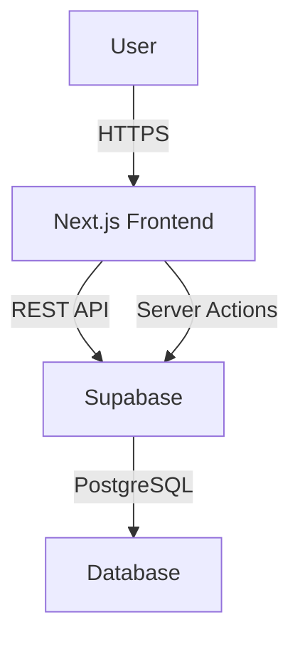

# Production-Grade Cross-Platform Development Standards
## Next.js 14 + Supabase + Vercel + Cursor AI

This document establishes comprehensive standards for building cross-platform applications (PWA + native iOS/Android) with shared codebases. It addresses the specific challenges of AI-assisted development, preventing code drift, and maintaining architectural consistency across long projects.

---

# Part 1: Cross-Platform Architecture

## Monorepo strategy with Turborepo

**Turborepo** is the recommended monorepo tool for Next.js + React Native projects due to its simpler setup, Vercel ecosystem integration, and excellent build performance. Choose Nx only for very large enterprise projects with multiple languages.

### Optimal monorepo folder structure

```
my-app/
├── apps/
│   ├── web/                      # Next.js 14 App Router
│   │   ├── app/
│   │   ├── public/
│   │   ├── next.config.js
│   │   └── package.json
│   └── mobile/                   # React Native (Expo)
│       ├── app/                  # Expo Router
│       ├── metro.config.js
│       ├── app.config.ts
│       └── package.json
├── packages/
│   ├── ui/                       # Shared UI components
│   │   ├── src/
│   │   │   ├── Button/
│   │   │   │   ├── Button.tsx        # Cross-platform
│   │   │   │   ├── Button.web.tsx    # Web-specific
│   │   │   │   └── Button.native.tsx # Native-specific
│   │   ├── package.json
│   │   └── tsconfig.json
│   ├── api/                      # Typed API client
│   ├── config/                   # ESLint, TSConfig, Prettier
│   ├── types/                    # Global types and schemas
│   └── app/                      # Shared screens/features (Solito)
├── .github/workflows/
├── turbo.json
├── package.json
├── pnpm-workspace.yaml
└── tsconfig.base.json
```

### Essential configuration files

**turbo.json:**
```json
{
  "$schema": "https://turbo.build/schema.json",
  "globalDependencies": ["**/.env.*local"],
  "pipeline": {
    "build": {
      "dependsOn": ["^build"],
      "outputs": [".next/**", "!.next/cache/**", "dist/**"]
    },
    "dev": {
      "cache": false,
      "persistent": true
    },
    "lint": {},
    "typecheck": {
      "dependsOn": ["^build"]
    }
  }
}
```

**pnpm-workspace.yaml:**
```yaml
packages:
  - 'apps/*'
  - 'packages/*'
```

**next.config.js (for monorepo):**
```javascript
/** @type {import('next').NextConfig} */
const nextConfig = {
  transpilePackages: ['@acme/ui', '@acme/api', '@acme/app'],
  experimental: {
    serverComponentsExternalPackages: ['react-native-web']
  }
}
module.exports = nextConfig
```

## Code sharing between web and mobile

### Solito for cross-platform navigation

**Solito** provides a tiny wrapper around React Navigation and Next.js router, enabling URL-based navigation that works identically on both platforms.

```tsx
// packages/app/features/home/screen.tsx
import { TextLink } from 'solito/link'
import { useRouter } from 'solito/navigation'

export function HomeScreen() {
  const router = useRouter()
  
  return (
    <View>
      <TextLink href="/user/123">View User</TextLink>
      <Button onPress={() => router.push('/settings')}>
        Settings
      </Button>
    </View>
  )
}
```

### Platform-specific code organization

Use file extensions to organize platform-specific implementations:

| Extension | Purpose |
|-----------|---------|
| `.tsx` | Shared code (default) |
| `.web.tsx` | Web-only implementation |
| `.native.tsx` | React Native only |
| `.ios.tsx` / `.android.tsx` | Platform-specific native |

**Example structure:**
```
packages/ui/src/DatePicker/
├── DatePicker.tsx          # Re-exports correct version
├── DatePicker.web.tsx      # Uses HTML date input
├── DatePicker.native.tsx   # Uses @react-native-community/datetimepicker
└── index.ts
```

### Cross-platform UI library selection

| Library | Best For | Notes |
|---------|----------|-------|
| **Tamagui** | Maximum code sharing, performance | Optimizing compiler, full design system |
| **NativeWind** | Teams familiar with Tailwind | Simpler setup, uses Tailwind classes |
| **Gluestack** | Production apps, copy-paste | Universal components |

**Recommendation:** Use **Tamagui** for complex apps requiring maximum code sharing, or **NativeWind** for faster onboarding with Tailwind-familiar teams.

## PWA setup for Next.js 14 with App Router

### Serwist configuration (next-pwa successor)

```bash
pnpm add @serwist/next serwist
```

**next.config.js:**
```javascript
const withSerwist = require('@serwist/next').default({
  swSrc: 'app/sw.ts',
  swDest: 'public/sw.js',
  cacheOnFrontEndNav: true,
  aggressiveFrontEndNavCaching: true,
  reloadOnOnline: true,
  disable: process.env.NODE_ENV === 'development'
})

module.exports = withSerwist({
  // Your Next.js config
})
```

### Web app manifest

Create `app/manifest.ts`:
```typescript
import type { MetadataRoute } from 'next'

export default function manifest(): MetadataRoute.Manifest {
  return {
    name: 'My PWA App',
    short_name: 'MyPWA',
    description: 'A Progressive Web App built with Next.js',
    start_url: '/',
    display: 'standalone',
    background_color: '#ffffff',
    theme_color: '#000000',
    icons: [
      { src: '/icons/icon-192x192.png', sizes: '192x192', type: 'image/png' },
      { src: '/icons/icon-512x512.png', sizes: '512x512', type: 'image/png' }
    ]
  }
}
```

### Service worker with push notifications

**app/sw.ts:**
```typescript
import { defaultCache } from '@serwist/next/worker'
import { Serwist } from 'serwist'

const serwist = new Serwist({
  precacheEntries: self.__SW_MANIFEST,
  skipWaiting: true,
  clientsClaim: true,
  navigationPreload: true,
  runtimeCaching: defaultCache
})

serwist.addEventListeners()

// Push notification handling
self.addEventListener('push', (event) => {
  if (event.data) {
    const data = event.data.json()
    event.waitUntil(
      self.registration.showNotification(data.title, {
        body: data.body,
        icon: '/icons/icon-192x192.png',
        badge: '/icons/badge.png',
        vibrate: [100, 50, 100]
      })
    )
  }
})
```

## Native app deployment with Expo EAS

### eas.json configuration

```json
{
  "cli": { "version": ">= 5.0.0" },
  "build": {
    "development": {
      "developmentClient": true,
      "distribution": "internal",
      "ios": { "simulator": true }
    },
    "preview": {
      "distribution": "internal",
      "channel": "preview"
    },
    "production": {
      "channel": "production",
      "autoIncrement": true
    }
  },
  "submit": {
    "production": {
      "ios": {
        "appleId": "your-apple-id@email.com",
        "ascAppId": "your-app-store-connect-id"
      },
      "android": {
        "serviceAccountKeyPath": "./google-service-account.json",
        "track": "internal"
      }
    }
  }
}
```

### Store requirements checklist

**iOS (Apple App Store):**
- $99/year Apple Developer Program
- App-specific icons (1024x1024 for App Store)
- Privacy policy URL required
- App review guidelines compliance

**Android (Google Play Store):**
- $25 one-time Google Play Developer account
- AAB format (default with EAS)
- Target API level 34+ (Android 14)
- Privacy policy required

---

# Part 2: Design System Architecture

## Design token architecture

### Token structure for AI-friendly development

Organize tokens hierarchically so AI tools can easily understand and reference them:

```
tokens/
├── primitive/           # Raw values
│   ├── colors.json
│   ├── spacing.json
│   └── typography.json
├── semantic/            # Purpose-based tokens
│   ├── surfaces.json
│   ├── text.json
│   └── interactive.json
└── component/           # Component-specific
    ├── button.json
    └── card.json
```

### Naming conventions that AI tools follow

- Use **semantic names** over mechanical ones: `text-subtle` instead of `text-gray-500`
- Follow **category-property-variant** pattern: `color-background-hover`
- Use **kebab-case** for CSS variables, matching Tailwind conventions
- Prefix state tokens: `hover__backgroundColor`, `focus__borderColor`

## Tailwind CSS configuration

### Production tailwind.config.ts

```typescript
import type { Config } from 'tailwindcss';

const config: Config = {
  content: [
    './src/**/*.{js,ts,jsx,tsx,mdx}',
    './components/**/*.{js,ts,jsx,tsx,mdx}',
  ],
  darkMode: 'class',
  theme: {
    extend: {
      colors: {
        background: 'var(--background)',
        foreground: 'var(--foreground)',
        primary: {
          DEFAULT: 'var(--primary)',
          foreground: 'var(--primary-foreground)',
        },
        secondary: {
          DEFAULT: 'var(--secondary)',
          foreground: 'var(--secondary-foreground)',
        },
        muted: {
          DEFAULT: 'var(--muted)',
          foreground: 'var(--muted-foreground)',
        },
        destructive: {
          DEFAULT: 'var(--destructive)',
          foreground: 'var(--destructive-foreground)',
        },
        border: 'var(--border)',
        input: 'var(--input)',
        ring: 'var(--ring)',
      },
      borderRadius: {
        lg: 'var(--radius)',
        md: 'calc(var(--radius) - 2px)',
        sm: 'calc(var(--radius) - 4px)',
      },
      fontFamily: {
        sans: ['var(--font-geist-sans)', 'system-ui', 'sans-serif'],
        mono: ['var(--font-geist-mono)', 'monospace'],
      },
    },
  },
  plugins: [
    require('tailwindcss-animate'),
    require('@tailwindcss/typography'),
  ],
};

export default config;
```

### CSS variables setup (globals.css)

```css
@tailwind base;
@tailwind components;
@tailwind utilities;

@layer base {
  :root {
    --background: 0 0% 100%;
    --foreground: 222.2 84% 4.9%;
    --primary: 222.2 47.4% 11.2%;
    --primary-foreground: 210 40% 98%;
    --secondary: 210 40% 96.1%;
    --secondary-foreground: 222.2 47.4% 11.2%;
    --muted: 210 40% 96.1%;
    --muted-foreground: 215.4 16.3% 46.9%;
    --destructive: 0 84.2% 60.2%;
    --destructive-foreground: 210 40% 98%;
    --border: 214.3 31.8% 91.4%;
    --input: 214.3 31.8% 91.4%;
    --ring: 222.2 84% 4.9%;
    --radius: 0.5rem;
  }

  .dark {
    --background: 222.2 84% 4.9%;
    --foreground: 210 40% 98%;
    --primary: 210 40% 98%;
    --primary-foreground: 222.2 47.4% 11.2%;
    /* ... dark mode tokens */
  }
}
```

## Component library structure with CVA

### Class Variance Authority pattern

```typescript
// components/ui/button.tsx
import { cva, type VariantProps } from 'class-variance-authority';
import { cn } from '@/lib/utils';

const buttonVariants = cva(
  [
    'inline-flex items-center justify-center',
    'rounded-md text-sm font-medium',
    'ring-offset-background transition-colors',
    'focus-visible:outline-none focus-visible:ring-2',
    'focus-visible:ring-ring focus-visible:ring-offset-2',
    'disabled:pointer-events-none disabled:opacity-50',
  ],
  {
    variants: {
      variant: {
        default: 'bg-primary text-primary-foreground hover:bg-primary/90',
        destructive: 'bg-destructive text-destructive-foreground hover:bg-destructive/90',
        outline: 'border border-input bg-background hover:bg-accent',
        secondary: 'bg-secondary text-secondary-foreground hover:bg-secondary/80',
        ghost: 'hover:bg-accent hover:text-accent-foreground',
        link: 'text-primary underline-offset-4 hover:underline',
      },
      size: {
        default: 'h-10 px-4 py-2',
        sm: 'h-9 rounded-md px-3',
        lg: 'h-11 rounded-md px-8',
        icon: 'h-10 w-10',
      },
    },
    defaultVariants: {
      variant: 'default',
      size: 'default',
    },
  }
);

export interface ButtonProps
  extends React.ButtonHTMLAttributes<HTMLButtonElement>,
    VariantProps<typeof buttonVariants> {
  asChild?: boolean;
}

const Button = React.forwardRef<HTMLButtonElement, ButtonProps>(
  ({ className, variant, size, ...props }, ref) => (
    <button
      className={cn(buttonVariants({ variant, size, className }))}
      ref={ref}
      {...props}
    />
  )
);
```

### Component folder organization

```
src/components/
├── ui/                    # shadcn/ui primitives
│   ├── button.tsx
│   ├── input.tsx
│   ├── card.tsx
│   └── dialog.tsx
├── atoms/                 # Basic building blocks
│   ├── Icon/
│   ├── Badge/
│   └── Avatar/
├── molecules/             # Combinations of atoms
│   ├── SearchBar/
│   ├── FormField/
│   └── NavItem/
├── organisms/             # Complex UI sections
│   ├── Header/
│   ├── Sidebar/
│   └── DataTable/
└── templates/             # Page layouts
    ├── DashboardLayout/
    └── AuthLayout/
```

## Accessibility requirements

### WCAG 2.1 AA compliance checklist

- **Color Contrast**: 4.5:1 for normal text, 3:1 for large text
- **Focus Indicators**: Visible focus states on all interactive elements
- **Keyboard Navigation**: Full functionality via keyboard
- **Screen Reader Support**: Proper ARIA labels and semantic HTML

### Required accessibility patterns

```tsx
// Skip Link Component
function SkipLink() {
  return (
    <a
      href="#main-content"
      className="sr-only focus:not-sr-only focus:absolute focus:top-0 
                 focus:left-0 focus:z-50 focus:bg-primary focus:p-4"
    >
      Skip to main content
    </a>
  );
}

// Live Region for Dynamic Updates
function LiveAnnouncer({ message }: { message: string }) {
  return (
    <div role="alert" aria-live="polite" aria-atomic="true" className="sr-only">
      {message}
    </div>
  );
}
```

### Animation with reduced motion support

```tsx
import { motion, useReducedMotion } from 'framer-motion';

function AnimatedCard({ children }: { children: React.ReactNode }) {
  const shouldReduceMotion = useReducedMotion();

  return (
    <motion.div
      initial={{ opacity: 0, y: 20 }}
      animate={{ opacity: 1, y: 0 }}
      transition={{
        duration: shouldReduceMotion ? 0 : 0.3,
        ease: 'easeOut',
      }}
    >
      {children}
    </motion.div>
  );
}
```

---

# Part 3: Project Structure & Scaffolding

## Optimal Next.js 14 App Router structure

```
src/
├── app/                          # App Router - routes and layouts
│   ├── layout.tsx                # Root layout (required)
│   ├── page.tsx                  # Homepage (/)
│   ├── error.tsx                 # Global error handler
│   ├── loading.tsx               # Global loading state
│   ├── not-found.tsx             # 404 page
│   ├── (auth)/                   # Route group (doesn't affect URL)
│   │   ├── login/page.tsx        # /login
│   │   └── signup/page.tsx       # /signup
│   ├── (marketing)/              # Route group for marketing pages
│   │   ├── features/page.tsx     # /features
│   │   └── pricing/page.tsx      # /pricing
│   ├── dashboard/
│   │   ├── layout.tsx            # Dashboard-specific layout
│   │   ├── page.tsx              # /dashboard
│   │   └── settings/page.tsx     # /dashboard/settings
│   └── api/                      # API routes
│       └── [...route]/route.ts
├── components/                   # Shared components
│   ├── ui/                       # Reusable UI primitives
│   └── features/                 # Feature-specific components
├── features/                     # Feature-based modules
│   └── posts/
│       ├── components/
│       ├── hooks/
│       ├── api/
│       ├── types/
│       └── utils/
├── lib/                          # Utility functions, API clients
├── hooks/                        # Shared custom hooks
├── types/                        # Global TypeScript types
├── config/                       # App configuration
├── styles/                       # Global styles
├── stores/                       # Global state (Zustand)
└── utils/                        # Shared utility functions
```

### Key folder conventions

| Convention | Purpose |
|------------|---------|
| `(groupName)/` | Route groups - organize routes without affecting URL |
| `_folderName/` | Private folders - exclude from routing |
| `@folderName/` | Parallel routes - render multiple pages in same layout |

## TypeScript configuration

### Strict tsconfig.json

```json
{
  "compilerOptions": {
    "target": "es2022",
    "lib": ["dom", "dom.iterable", "esnext"],
    "allowJs": true,
    "skipLibCheck": true,
    "esModuleInterop": true,
    "resolveJsonModule": true,
    "moduleDetection": "force",
    "isolatedModules": true,
    "verbatimModuleSyntax": true,
    "module": "esnext",
    "moduleResolution": "bundler",
    "jsx": "preserve",
    "incremental": true,
    "noEmit": true,
    
    "strict": true,
    "noUncheckedIndexedAccess": true,
    "noImplicitOverride": true,
    "exactOptionalPropertyTypes": true,
    "noPropertyAccessFromIndexSignature": true,
    "noImplicitReturns": true,
    "noFallthroughCasesInSwitch": true,
    "noUnusedLocals": true,
    "noUnusedParameters": true,
    "forceConsistentCasingInFileNames": true,
    
    "baseUrl": ".",
    "paths": {
      "@/*": ["./src/*"],
      "@/components/*": ["./src/components/*"],
      "@/lib/*": ["./src/lib/*"],
      "@/hooks/*": ["./src/hooks/*"],
      "@/types/*": ["./src/types/*"],
      "@/features/*": ["./src/features/*"]
    },
    
    "plugins": [{ "name": "next" }]
  },
  "include": ["next-env.d.ts", "**/*.ts", "**/*.tsx", ".next/types/**/*.ts"],
  "exclude": ["node_modules"]
}
```

## Code quality tooling

### ESLint configuration

```json
{
  "root": true,
  "parser": "@typescript-eslint/parser",
  "parserOptions": {
    "project": "./tsconfig.json",
    "ecmaVersion": 2024,
    "ecmaFeatures": { "jsx": true },
    "sourceType": "module"
  },
  "extends": [
    "next/core-web-vitals",
    "eslint:recommended",
    "plugin:@typescript-eslint/recommended",
    "prettier"
  ],
  "plugins": ["@typescript-eslint"],
  "rules": {
    "@typescript-eslint/no-unused-vars": ["error", { "argsIgnorePattern": "^_" }],
    "import/order": ["error", {
      "groups": ["builtin", "external", "internal", "parent", "sibling", "index"],
      "newlines-between": "always",
      "alphabetize": { "order": "asc" }
    }]
  }
}
```

### Prettier configuration

```json
{
  "semi": true,
  "singleQuote": true,
  "trailingComma": "es5",
  "tabWidth": 2,
  "printWidth": 80,
  "endOfLine": "lf",
  "bracketSpacing": true,
  "plugins": ["prettier-plugin-tailwindcss"]
}
```

### Git hooks with Husky

**package.json:**
```json
{
  "scripts": {
    "prepare": "husky",
    "lint": "next lint",
    "format": "prettier --write .",
    "check-types": "tsc --noEmit"
  },
  "lint-staged": {
    "**/*.{ts,tsx}": ["prettier --write", "eslint --fix"],
    "**/*.{json,md}": ["prettier --write"]
  }
}
```

## Environment configuration with T3-Env

**src/env.ts:**
```typescript
import { createEnv } from "@t3-oss/env-nextjs";
import { z } from "zod";

export const env = createEnv({
  server: {
    DATABASE_URL: z.string().url(),
    NODE_ENV: z.enum(["development", "test", "production"]),
    SUPABASE_SERVICE_ROLE_KEY: z.string().min(1),
  },
  client: {
    NEXT_PUBLIC_SUPABASE_URL: z.string().url(),
    NEXT_PUBLIC_SUPABASE_ANON_KEY: z.string().min(1),
    NEXT_PUBLIC_APP_URL: z.string().url(),
  },
  runtimeEnv: {
    DATABASE_URL: process.env.DATABASE_URL,
    NODE_ENV: process.env.NODE_ENV,
    SUPABASE_SERVICE_ROLE_KEY: process.env.SUPABASE_SERVICE_ROLE_KEY,
    NEXT_PUBLIC_SUPABASE_URL: process.env.NEXT_PUBLIC_SUPABASE_URL,
    NEXT_PUBLIC_SUPABASE_ANON_KEY: process.env.NEXT_PUBLIC_SUPABASE_ANON_KEY,
    NEXT_PUBLIC_APP_URL: process.env.NEXT_PUBLIC_APP_URL,
  },
});
```

## Git workflow and commit conventions

### Conventional commits format

```
<type>(<scope>): <description>

[optional body]

[optional footer]
```

**Types:**
- `feat:` - New feature
- `fix:` - Bug fix
- `docs:` - Documentation
- `style:` - Formatting (no code change)
- `refactor:` - Code change (no new feature/fix)
- `perf:` - Performance improvement
- `test:` - Adding tests
- `chore:` - Maintenance tasks

**commitlint.config.js:**
```javascript
module.exports = {
  extends: ['@commitlint/config-conventional'],
  rules: {
    'type-enum': [2, 'always', [
      'feat', 'fix', 'docs', 'style', 'refactor', 
      'perf', 'test', 'chore', 'ci', 'build', 'revert'
    ]],
    'subject-max-length': [2, 'always', 72]
  }
};
```

---

# Part 4: Supabase Best Practices

## Database schema design

### Naming conventions

Use **snake_case** for all PostgreSQL table and column names:

```sql
CREATE TABLE user_profiles (
  id uuid PRIMARY KEY DEFAULT gen_random_uuid(),
  user_id uuid REFERENCES auth.users NOT NULL,
  display_name text,
  created_at timestamptz DEFAULT now(),
  updated_at timestamptz DEFAULT now()
);
```

### Relationship patterns

```sql
-- One-to-Many: Organization has many members
CREATE TABLE organizations (
  id uuid PRIMARY KEY DEFAULT gen_random_uuid(),
  name text NOT NULL,
  created_at timestamptz DEFAULT now()
);

CREATE TABLE members (
  id uuid PRIMARY KEY DEFAULT gen_random_uuid(),
  organization_id uuid REFERENCES organizations(id) ON DELETE CASCADE,
  user_id uuid REFERENCES auth.users(id) ON DELETE CASCADE,
  role text DEFAULT 'member',
  UNIQUE(organization_id, user_id)
);

-- Junction Table for Many-to-Many
CREATE TABLE project_members (
  project_id uuid REFERENCES projects(id) ON DELETE CASCADE,
  user_id uuid REFERENCES auth.users(id) ON DELETE CASCADE,
  PRIMARY KEY (project_id, user_id)
);
```

## Row-Level Security patterns

### User-based access control

```sql
ALTER TABLE todos ENABLE ROW LEVEL SECURITY;

-- SELECT policy
CREATE POLICY "Users can view own todos"
ON todos FOR SELECT
TO authenticated
USING ((SELECT auth.uid()) = user_id);

-- INSERT policy
CREATE POLICY "Users can create own todos"
ON todos FOR INSERT
TO authenticated
WITH CHECK ((SELECT auth.uid()) = user_id);

-- UPDATE policy
CREATE POLICY "Users can update own todos"
ON todos FOR UPDATE
TO authenticated
USING ((SELECT auth.uid()) = user_id)
WITH CHECK ((SELECT auth.uid()) = user_id);

-- DELETE policy
CREATE POLICY "Users can delete own todos"
ON todos FOR DELETE
TO authenticated
USING ((SELECT auth.uid()) = user_id);
```

### Organization/team multi-tenancy

```sql
-- Helper function for tenant isolation
CREATE OR REPLACE FUNCTION is_org_member(org_id uuid)
RETURNS boolean AS $$
  SELECT EXISTS (
    SELECT 1 FROM members
    WHERE organization_id = org_id
    AND user_id = (SELECT auth.uid())
  );
$$ LANGUAGE SQL SECURITY DEFINER STABLE;

-- RLS Policy
CREATE POLICY "Organization members can view"
ON projects FOR SELECT
TO authenticated
USING ((SELECT is_org_member(organization_id)));
```

### RLS performance optimization rules

- **Always wrap functions with SELECT**: `(SELECT auth.uid())` caches per statement
- **Add indexes on RLS columns**: `CREATE INDEX idx_todos_user_id ON todos(user_id);`
- **Avoid joins in policies**: Use `IN` with subqueries instead
- **Always specify roles**: `TO authenticated` prevents evaluation for anon users

## Authentication with Next.js 14 App Router

### Server client utility

**lib/supabase/server.ts:**
```typescript
import { createServerClient } from '@supabase/ssr'
import { cookies } from 'next/headers'

export async function createClient() {
  const cookieStore = await cookies()
  
  return createServerClient(
    process.env.NEXT_PUBLIC_SUPABASE_URL!,
    process.env.NEXT_PUBLIC_SUPABASE_ANON_KEY!,
    {
      cookies: {
        getAll() {
          return cookieStore.getAll()
        },
        setAll(cookiesToSet) {
          try {
            cookiesToSet.forEach(({ name, value, options }) =>
              cookieStore.set(name, value, options)
            )
          } catch {}
        },
      },
    }
  )
}
```

### Middleware for session refresh

**middleware.ts:**
```typescript
import { createServerClient } from '@supabase/ssr'
import { NextResponse, type NextRequest } from 'next/server'

export async function middleware(request: NextRequest) {
  let supabaseResponse = NextResponse.next({ request })

  const supabase = createServerClient(
    process.env.NEXT_PUBLIC_SUPABASE_URL!,
    process.env.NEXT_PUBLIC_SUPABASE_ANON_KEY!,
    {
      cookies: {
        getAll() {
          return request.cookies.getAll()
        },
        setAll(cookiesToSet) {
          cookiesToSet.forEach(({ name, value }) => 
            request.cookies.set(name, value)
          )
          supabaseResponse = NextResponse.next({ request })
          cookiesToSet.forEach(({ name, value, options }) =>
            supabaseResponse.cookies.set(name, value, options)
          )
        },
      },
    }
  )

  // IMPORTANT: Always use getUser(), never trust getSession() on server
  await supabase.auth.getUser()
  
  return supabaseResponse
}

export const config = {
  matcher: ['/((?!_next/static|_next/image|favicon.ico|.*\\.(?:svg|png|jpg|jpeg|gif|webp)$).*)'],
}
```

### Server component auth check

```typescript
import { createClient } from '@/lib/supabase/server'
import { redirect } from 'next/navigation'

export default async function DashboardPage() {
  const supabase = await createClient()
  
  // Always use getUser() - validates JWT with Supabase Auth server
  const { data: { user }, error } = await supabase.auth.getUser()
  
  if (error || !user) {
    redirect('/login')
  }
  
  return <div>Welcome {user.email}</div>
}
```

## Migration strategies

### Supabase CLI workflow

```bash
# Initialize Supabase in project
npx supabase init

# Start local development
npx supabase start

# Create new migration
npx supabase migration new create_todos_table

# Apply to local database
npx supabase db reset

# Push to remote
npx supabase db push
```

**Migration file example:**
```sql
-- supabase/migrations/20240115120000_create_todos_table.sql
CREATE TABLE todos (
  id uuid PRIMARY KEY DEFAULT gen_random_uuid(),
  user_id uuid REFERENCES auth.users NOT NULL,
  title text NOT NULL,
  completed boolean DEFAULT false,
  created_at timestamptz DEFAULT now()
);

ALTER TABLE todos ENABLE ROW LEVEL SECURITY;

CREATE POLICY "Users can CRUD own todos"
ON todos FOR ALL TO authenticated
USING ((SELECT auth.uid()) = user_id)
WITH CHECK ((SELECT auth.uid()) = user_id);

CREATE INDEX idx_todos_user_id ON todos(user_id);
```

## Performance optimization

### Index strategies

```sql
-- B-tree for equality/range queries
CREATE INDEX idx_todos_user_id ON todos(user_id);

-- Composite index for common query patterns
CREATE INDEX idx_todos_user_status ON todos(user_id, completed);

-- Partial index for filtered queries
CREATE INDEX idx_active_todos ON todos(user_id) 
WHERE completed = false;

-- BRIN for time-series data (10x smaller)
CREATE INDEX idx_logs_created ON audit_logs 
USING BRIN(created_at);
```

---

# Part 5: Vercel Deployment Optimization

## Environment management

### Branch-based deployment strategy

| Environment | Branch | Domain | Purpose |
|-------------|--------|--------|---------|
| Production | `main` | `app.example.com` | Live users |
| Staging | `staging` | `staging.example.com` | Pre-release testing |
| Preview | Feature branches | `*.vercel.app` | PR reviews |

**Environment variable management:**
```bash
# Pull environment variables locally
vercel env pull .env.local

# Add variables via CLI
vercel env add MY_SECRET production
vercel env add MY_SECRET preview
```

## Edge functions vs serverless

### When to use each runtime

| Use Edge Runtime For | Use Node.js Runtime For |
|---------------------|------------------------|
| Authentication/authorization | Database connections (TCP) |
| A/B testing and feature flags | Heavy computation |
| Geographic routing | Large dependencies |
| URL rewrites/redirects | Full Node.js API needs |
| Low-latency responses (<50ms cold starts) | Longer execution times |

**Edge function example:**
```typescript
// app/api/edge-route/route.ts
export const runtime = 'edge';

export async function GET(request: Request) {
  return new Response('Hello from Edge!');
}
```

## Caching strategies

### Rendering strategy decision framework

| Strategy | Use Case |
|----------|----------|
| SSG | Marketing pages, blogs |
| ISR | E-commerce products, news (revalidate: 60) |
| SSR | Dashboards, user-specific content |
| PPR | Mix static shell + dynamic content |

**ISR with on-demand revalidation:**
```typescript
// Time-based
export const revalidate = 60;

// Tag-based
const data = await fetch(url, {
  next: { tags: ['posts', 'blog'] }
});

// On-demand
import { revalidateTag } from 'next/cache';
revalidateTag('posts');
```

### Cache headers

```typescript
export async function GET() {
  return new Response('Data', {
    headers: {
      'Cache-Control': 'public, s-maxage=60, stale-while-revalidate=3600',
      'CDN-Cache-Control': 'max-age=3600',
      'Vercel-CDN-Cache-Control': 'max-age=86400'
    }
  });
}
```

## Cost optimization strategies

- **Audit rendering strategies**: Convert SSR to ISR where possible
- **Implement aggressive caching**: Use `stale-while-revalidate`
- **Use Edge for lightweight routes**: Authentication, redirects (~15x cheaper)
- **Enable Fluid Compute**: Automatic concurrency optimization
- **Monitor function execution time**: Reduce database queries
- **Use `revalidateTag` over `revalidatePath`**: More precise, less expensive

---

# Part 6: Data-Driven App Patterns

## Time-series data architecture

### TimescaleDB for PostgreSQL (Supabase extension)

```sql
-- Create hypertable for automatic time partitioning
CREATE TABLE sensor_data (
  time TIMESTAMPTZ NOT NULL,
  user_id INTEGER NOT NULL,
  heart_rate DOUBLE PRECISION
);
SELECT create_hypertable('sensor_data', 'time');

-- Continuous aggregates for pre-computed rollups
CREATE MATERIALIZED VIEW daily_stats
WITH (timescaledb.continuous) AS
SELECT user_id,
       time_bucket(INTERVAL '1 day', time) AS bucket,
       AVG(heart_rate), MAX(heart_rate), MIN(heart_rate)
FROM sensor_data
GROUP BY user_id, bucket;

-- Auto-refresh policy
SELECT add_continuous_aggregate_policy('daily_stats',
  start_offset => INTERVAL '1 month',
  end_offset => INTERVAL '1 day',
  schedule_interval => INTERVAL '1 hour'
);
```

### Data aggregation strategy

| Granularity | Use Case | Retention |
|-------------|----------|-----------|
| Raw (ms) | Real-time displays | 90 days |
| Minute | Live dashboards | 6 months |
| Hourly | Day-view charts | 2 years |
| Daily | Weekly summaries | Forever |
| Weekly | Monthly analytics | Forever |

## Gamification systems

### Streak tracking implementation

**Data model:**
```sql
CREATE TABLE streaks (
  user_id uuid REFERENCES auth.users PRIMARY KEY,
  current_streak integer DEFAULT 0,
  longest_streak integer DEFAULT 0,
  last_activity_date date,
  streak_freeze_available boolean DEFAULT false,
  streak_started_at timestamptz
);
```

**Key patterns from top apps:**
- **Visual indicators**: Display current streak prominently
- **Loss aversion**: "Don't break your streak!" messaging
- **Streak protection**: Allow occasional misses (premium feature)
- **Milestone celebrations**: 7-day, 30-day, 100-day achievements

### Achievement system structure

```sql
CREATE TABLE achievements (
  id uuid PRIMARY KEY DEFAULT gen_random_uuid(),
  name text NOT NULL,
  description text,
  icon_url text,
  criteria_json jsonb
);

CREATE TABLE user_achievements (
  user_id uuid REFERENCES auth.users,
  achievement_id uuid REFERENCES achievements,
  earned_at timestamptz DEFAULT now(),
  PRIMARY KEY (user_id, achievement_id)
);
```

## Data visualization library selection

| Library | Best For | Weekly Downloads |
|---------|----------|-----------------|
| **Recharts** | Quick implementation, React projects | 8.1M+ |
| **Victory** | Cross-platform (same API web + RN) | 338K |
| **Tremor** | Dashboard UI with pre-built components | Growing |
| **react-native-gifted-charts** | Mobile (bar, line, pie, radar) | Top RN |

**Recommendation:** Use **Recharts** for web dashboards, **Victory Native** for cross-platform chart consistency.

## UX patterns from top fitness apps

### Apple Fitness Rings concept
- Three concentric rings (Move, Exercise, Stand)
- Visual progress filling clockwise throughout day
- Animation burst on completion
- Weekly 7-day grid view

### WHOOP Recovery Score presentation
- **0-100% single metric**: Simplifies complex biometric data
- **Color-coded**: Red (0-33%), Yellow (34-66%), Green (67-100%)
- **Contributing factors shown**: HRV, sleep, resting HR breakdown
- **Actionable insight**: Strain target adjusts based on recovery

### Push notification engagement strategies

Research shows push notifications increase app engagement by **88%**, and personalized notifications increase conversions by **~27%**.

**Key strategies:**
- Behavioral segmentation: Trigger based on user actions
- Time optimization: Analyze when users are most active
- Value framing: Frame as gains, not loss avoidance
- Deep linking: Link directly to relevant in-app content

---

# Part 7: AI-Assisted Development Standards

## Cursor IDE configuration

### .cursor/rules/*.mdc structure

The legacy `.cursorrules` is deprecated. Use `.cursor/rules/*.mdc` files:

```markdown
---
description: React component patterns
globs:
  - src/components/**/*.tsx
alwaysApply: false
---

- Use TypeScript with strict types
- Follow atomic design principles
- Use CVA for component variants
- Include JSDoc comments for all exported functions
- Follow naming: ComponentName.tsx
```

### Rule types and precedence

1. **Local (manual)**: Explicitly included with `@ruleName`
2. **Auto Attached**: Files matching glob patterns automatically referenced
3. **Agent Requested**: AI chooses to include if description matches
4. **Always**: Automatically included in all contexts

### What to include in Cursor rules

```markdown
# .cursor/rules/project.mdc
---
alwaysApply: true
---

## Tech Stack
- Next.js 14 with App Router
- Supabase for database and auth
- Tailwind CSS with shadcn/ui
- TypeScript with strict mode

## Code Style
- Prefer Server Components; use 'use client' only when needed
- Use existing utilities from @/lib/utils
- Follow existing patterns in codebase before creating new ones

## Before Creating New Code
1. Check if similar functionality exists
2. Search for existing hooks in @/hooks
3. Review component library in @/components/ui

## Naming Conventions
- Components: PascalCase (UserProfileCard.tsx)
- Hooks: camelCase with 'use' prefix (useUserProfile.ts)
- Utilities: camelCase, action-oriented (formatCurrency.ts)
```

## Preventing duplicate functionality

### Naming conventions that prevent duplicates

```typescript
// Bad - generic, easily duplicated
const handleClick = () => {}
const utils = {}

// Good - domain-specific, searchable
const handleUserProfileUpdate = () => {}
const dateFormattingUtils = {}
```

### Code organization for AI discoverability

**Feature-based organization:**
```
src/features/
├── authentication/
│   ├── components/
│   ├── hooks/
│   ├── services/
│   └── index.ts
├── user-management/
│   ├── components/
│   ├── hooks/
│   └── index.ts
```

### Centralized utility pattern

```typescript
// src/utils/index.ts - discovery file
export * from './date';
export * from './string';
export * from './validation';

// .cursor/rules instruction
"Before creating new utility functions, check src/utils/ for existing implementations"
```

## Architecture Decision Records (ADRs)

### MADR template

```markdown
# ADR-001: Use TypeScript for all new code

## Status
Accepted

## Context and Problem Statement
We need to decide on a type system approach for improved code quality.

## Considered Options
1. Plain JavaScript with JSDoc
2. TypeScript
3. Flow

## Decision Outcome
Chosen option: "TypeScript", because:
- Better IDE support and autocomplete
- Catches errors at compile time
- Industry standard adoption

## Consequences
### Positive
- Improved code quality
- Better refactoring support

### Negative
- Learning curve for new team members
- Build step required

## Related Decisions
- ADR-002: Use strict TypeScript config
```

Store under `docs/adr/` and number sequentially.

## Code review checklist for AI-generated code

### Common AI code smells

| Issue | Description |
|-------|-------------|
| **Readability** | Violates local patterns in naming, clarity |
| **Missing error handling** | Omits null checks, exception logic |
| **Security gaps** | Improper input handling |
| **Performance** | Excessive operations favoring clarity |
| **Style drift** | Spacing, indentation inconsistencies |

### Review checklist

**Architectural Alignment:**
- [ ] Follows established patterns in codebase
- [ ] Uses existing utilities (not duplicating)
- [ ] Respects module boundaries
- [ ] Consistent with ADRs

**Logic & Safety:**
- [ ] Proper error handling (not just happy path)
- [ ] Edge cases covered
- [ ] Input validation present
- [ ] No hardcoded secrets

**Code Quality:**
- [ ] Variable names match project conventions
- [ ] Comments explain "why" not "what"
- [ ] No unnecessary complexity
- [ ] DRY principle followed

---

# Part 8: State Management & Data Fetching

## Server vs client components decision framework

**Use Server Components (default) when:**
- Fetching data from databases/APIs
- Using API keys, tokens, secrets
- Reducing client-side JavaScript bundle

**Use Client Components (`"use client"`) when:**
- State management with `useState`, `useEffect`
- Event handlers (`onClick`, `onChange`)
- Browser-only APIs (localStorage, window)

### Interleaving pattern

```tsx
// Server Component (Page)
import Modal from './ui/modal'  // Client
import Cart from './ui/cart'    // Server

export default function Page() {
  return (
    <Modal>
      <Cart />  {/* Server Component passed as children */}
    </Modal>
  )
}
```

## TanStack Query with Supabase

### Query key conventions

```typescript
const organizationKeys = {
  all: ['organizations'] as const,
  byId: (id: string) => ['organizations', id] as const,
  members: (orgId: string) => ['organizations', orgId, 'members'] as const,
};

const { data } = useQuery({
  queryKey: organizationKeys.byId(orgId),
  queryFn: () => getOrganizationById(client, orgId),
});
```

### Optimistic updates pattern

```typescript
const mutation = useMutation({
  mutationFn: async (newItem) => {
    const { data, error } = await client.from('items').insert(newItem);
    if (error) throw error;
    return data;
  },
  onMutate: async (newItem) => {
    await queryClient.cancelQueries({ queryKey: ['items'] });
    const previous = queryClient.getQueryData(['items']);
    queryClient.setQueryData(['items'], old => [...old, newItem]);
    return { previous };
  },
  onError: (err, newItem, context) => {
    queryClient.setQueryData(['items'], context.previous);
  },
  onSettled: () => {
    queryClient.invalidateQueries({ queryKey: ['items'] });
  },
});
```

## Zustand for global state

### Next.js setup pattern

```typescript
// stores/user-store.ts
import { createStore } from 'zustand/vanilla'

export type UserState = { user: User | null }
export type UserActions = { setUser: (user: User) => void; logout: () => void }
export type UserStore = UserState & UserActions

export const createUserStore = (initState: UserState = { user: null }) => {
  return createStore<UserStore>()((set) => ({
    ...initState,
    setUser: (user) => set({ user }),
    logout: () => set({ user: null }),
  }))
}
```

```typescript
// providers/user-store-provider.tsx
'use client'
import { createContext, useContext, useRef } from 'react'
import { useStore } from 'zustand'
import { createUserStore, UserStore } from '@/stores/user-store'

const UserStoreContext = createContext<ReturnType<typeof createUserStore> | null>(null)

export function UserStoreProvider({ children }: { children: React.ReactNode }) {
  const storeRef = useRef<ReturnType<typeof createUserStore>>(null)
  if (!storeRef.current) {
    storeRef.current = createUserStore()
  }
  return (
    <UserStoreContext.Provider value={storeRef.current}>
      {children}
    </UserStoreContext.Provider>
  )
}
```

**Key guidelines:**
- Create stores per-request to avoid sharing across requests
- RSC cannot read/write stores - only use in Client Components
- Use `useShallow` for multiple state picks

## Form handling with Server Actions

```typescript
// actions.ts
'use server'
import { z } from 'zod'

const UserSchema = z.object({
  email: z.string().email(),
  name: z.string().min(2).max(50),
})

export async function createUser(formData: FormData) {
  const result = UserSchema.safeParse({
    email: formData.get('email'),
    name: formData.get('name'),
  })
  
  if (!result.success) {
    return { errors: result.error.flatten().fieldErrors }
  }
  // Safe to use result.data
}
```

```typescript
// form-component.tsx
"use client"
import { useForm } from 'react-hook-form'
import { zodResolver } from '@hookform/resolvers/zod'
import { useTransition } from 'react'

export function UserForm() {
  const [isPending, startTransition] = useTransition()
  const { register, handleSubmit, formState: { errors } } = useForm({
    resolver: zodResolver(UserSchema),
  })

  const onSubmit = (data) => {
    startTransition(async () => {
      await createUser(data)
    })
  }

  return (
    <form onSubmit={handleSubmit(onSubmit)}>
      <input {...register('email')} />
      {errors.email && <span>{errors.email.message}</span>}
      <button disabled={isPending}>Submit</button>
    </form>
  )
}
```

---

# Part 9: Testing & Quality Assurance

## Testing strategy overview

| Test Type | Tool | Purpose |
|-----------|------|---------|
| Unit | Vitest | Synchronous components, utilities |
| Integration | Vitest + Testing Library | Component interactions |
| E2E | Playwright | User flows, async Server Components |
| Visual Regression | Playwright | UI consistency |

## Vitest configuration

```typescript
// vitest.config.mts
import { defineConfig } from 'vitest/config'
import react from '@vitejs/plugin-react'
import tsconfigPaths from 'vite-tsconfig-paths'

export default defineConfig({
  plugins: [tsconfigPaths(), react()],
  test: {
    environment: 'jsdom',
    globals: true,
    setupFiles: 'src/setupTests.ts',
  },
})
```

### Unit testing components

```typescript
import { expect, test, vi } from 'vitest'
import { render, screen } from '@testing-library/react'
import userEvent from '@testing-library/user-event'
import { Button } from '@/components/ui/button'

test('button renders and handles click', async () => {
  const handleClick = vi.fn()
  render(<Button onClick={handleClick}>Click me</Button>)
  
  await userEvent.click(screen.getByRole('button'))
  expect(handleClick).toHaveBeenCalledOnce()
})
```

## Playwright E2E testing

```typescript
// playwright.config.ts
import { defineConfig, devices } from '@playwright/test'

export default defineConfig({
  testDir: './e2e',
  fullyParallel: true,
  webServer: {
    command: 'npm run dev',
    url: 'http://127.0.0.1:3000',
    reuseExistingServer: !process.env.CI,
  },
  projects: [
    { name: 'setup', testMatch: 'auth.setup.ts' },
    { 
      name: 'Features',
      testMatch: /.*\.feature\.ts/,
      dependencies: ['setup'],
      use: { 
        ...devices['Desktop Chrome'],
        storageState: 'playwright/.auth/user.json'
      }
    },
  ],
})
```

```typescript
// e2e/navigation.spec.ts
import { test, expect } from '@playwright/test'

test('navigation flow', async ({ page }) => {
  await page.goto('/')
  await page.click('text=About')
  await expect(page).toHaveURL('/about')
  await expect(page.locator('h1')).toContainText('About')
})

// Visual regression
test('homepage snapshot', async ({ page }) => {
  await page.goto('/')
  expect(await page.screenshot()).toMatchSnapshot('homepage.png')
})
```

---

# Part 10: Security Best Practices

## Content Security Policy

```typescript
// middleware.ts
export function middleware(request: NextRequest) {
  const nonce = Buffer.from(crypto.randomUUID()).toString('base64')
  const cspHeader = `
    default-src 'self';
    script-src 'self' 'nonce-${nonce}' 'strict-dynamic';
    style-src 'self' 'nonce-${nonce}';
    img-src 'self' blob: data:;
    font-src 'self';
    object-src 'none';
    base-uri 'self';
    form-action 'self';
    frame-ancestors 'none';
    upgrade-insecure-requests;
  `.replace(/\s{2,}/g, ' ').trim()
  
  const response = NextResponse.next()
  response.headers.set('Content-Security-Policy', cspHeader)
  return response
}
```

## Security headers

```javascript
// next.config.js
const securityHeaders = [
  { key: 'X-Content-Type-Options', value: 'nosniff' },
  { key: 'X-Frame-Options', value: 'DENY' },
  { key: 'X-XSS-Protection', value: '1; mode=block' },
  { key: 'Referrer-Policy', value: 'strict-origin-when-cross-origin' },
  { key: 'Strict-Transport-Security', value: 'max-age=63072000; includeSubDomains' },
]

module.exports = {
  async headers() {
    return [{ source: '/:path*', headers: securityHeaders }]
  }
}
```

## Rate limiting Server Actions

```typescript
'use server'
import { headers } from 'next/headers'

export async function publicAction() {
  const headersList = await headers()
  const ip = headersList.get('x-forwarded-for')?.split(',')[0] || '127.0.0.1'
  
  const { success } = await rateLimiter.limit(`action:${ip}`)
  if (!success) {
    return { error: 'Rate limited. Try again later.' }
  }
  // ... action logic
}
```

---

# Part 11: Performance Optimization

## Core Web Vitals targets

| Metric | Target | Key Optimizations |
|--------|--------|-------------------|
| LCP | < 2.5s | next/image, preload critical assets, SSG/ISR |
| INP | < 200ms | Server Components, code splitting, streaming |
| CLS | < 0.1 | Explicit dimensions, font-display:swap |

## Image optimization

```tsx
import Image from 'next/image'

export function HeroImage() {
  return (
    <Image
      src="/hero.jpg"
      alt="Hero"
      width={1200}
      height={800}
      priority          // Above-the-fold
      placeholder="blur" // Prevents CLS
      sizes="(max-width: 768px) 100vw, 50vw"
    />
  )
}
```

## Code splitting with dynamic imports

```tsx
import dynamic from 'next/dynamic'

const HeavyChart = dynamic(() => import('@/components/Chart'), {
  loading: () => <p>Loading chart...</p>,
  ssr: false // Client-only component
})
```

## Streaming with Suspense

```tsx
export default async function Page() {
  return (
    <>
      <Header /> {/* Static, renders immediately */}
      <Suspense fallback={<ProductSkeleton />}>
        <Products /> {/* Streams when ready */}
      </Suspense>
    </>
  )
}
```

---

# Part 12: Documentation Standards

## Required documentation files

| File | Purpose |
|------|---------|
| `README.md` | Project overview, setup, scripts |
| `CONTRIBUTING.md` | Contribution guidelines |
| `docs/adr/` | Architecture Decision Records |
| `.cursor/rules/*.mdc` | AI development guidelines |
| `CLAUDE.md` or `spec.md` | Project specification for AI |

## README template

```markdown
# Project Name

Brief description of the project.

## Prerequisites
- Node.js 20+
- pnpm

## Getting Started

### Installation
```bash
pnpm install
```

### Environment Setup
```bash
cp .env.example .env.local
# Fill in required values
```

### Development
```bash
pnpm dev
```

## Project Structure
```
src/
├── app/          # Next.js App Router
├── components/   # Reusable UI components
├── features/     # Feature modules
├── lib/          # Utilities and configurations
└── types/        # TypeScript type definitions
```

## Scripts
| Command | Description |
|---------|-------------|
| `pnpm dev` | Start development server |
| `pnpm build` | Build for production |
| `pnpm lint` | Run ESLint |
| `pnpm test` | Run tests |
```

## Architecture diagrams with Mermaid



---

# Quick Reference: Production Checklist

## Before deploying any feature

- [ ] TypeScript compiles without errors (`tsc --noEmit`)
- [ ] ESLint passes (`pnpm lint`)
- [ ] Tests pass (`pnpm test`)
- [ ] Accessibility audit passed (axe-core)
- [ ] Performance budget met (Lighthouse > 90)

## Supabase security checklist

- [ ] RLS enabled on all public schema tables
- [ ] Indexes on all RLS policy columns
- [ ] Use `(SELECT auth.uid())` not `auth.uid()` in policies
- [ ] Middleware configured for session refresh
- [ ] `getUser()` used for server-side auth (never `getSession()`)
- [ ] Service role key never exposed to client

## AI development workflow

- [ ] `.cursor/rules/` configured with project conventions
- [ ] Check for existing utilities before creating new ones
- [ ] Review all AI-generated code for architectural alignment
- [ ] Commit after each successful AI iteration
- [ ] Test edge cases AI might have missed

---

# Files Required in Every Project

```
├── .cursor/
│   └── rules/
│       ├── project.mdc          # Global project rules
│       ├── components.mdc       # Component patterns
│       └── database.mdc         # Database conventions
├── .github/
│   ├── PULL_REQUEST_TEMPLATE.md
│   └── workflows/
│       └── ci.yml
├── docs/
│   └── adr/
│       └── 000-template.md
├── src/
│   ├── env.ts                   # T3-Env configuration
│   └── lib/
│       ├── supabase/
│       │   ├── client.ts
│       │   └── server.ts
│       └── utils.ts             # cn() and shared utilities
├── .env.example
├── .eslintrc.json
├── .prettierrc
├── commitlint.config.js
├── middleware.ts
├── next.config.js
├── tailwind.config.ts
├── tsconfig.json
└── vitest.config.mts
```

This comprehensive document provides the foundation for building production-grade cross-platform applications while maintaining consistency and preventing the common problems of AI-assisted development.